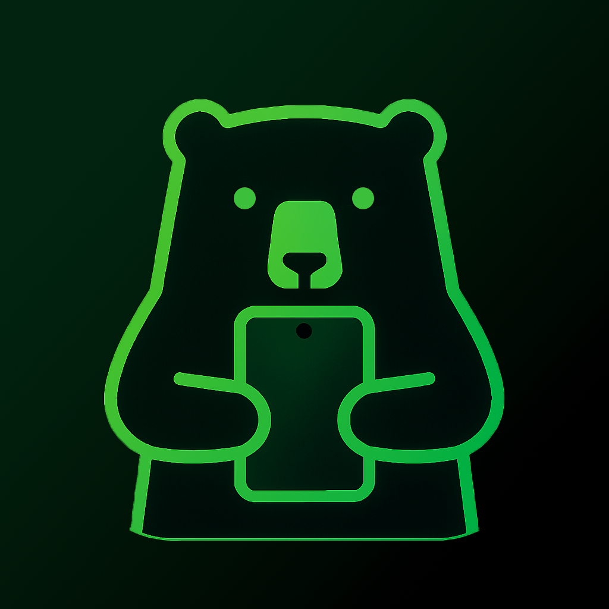

<p float="left">
  <!--  -->
   
  
  
</p>

# Ursa

An Android application that converts natural language user commands into machine code instructions for robotic control, leveraging an on-device large language model (LLM). This project employs the **LlaMA 3.2-3B** model and integrates Qualcomm’s [Chat App Demo](https://github.com/quic/ai-hub-apps/tree/main/apps/android/ChatApp). Sponsored by **Qualcomm**.

## Overview

This application enables voice-based natural language commands to be translated into robot control code (ROS2) through a fully offline, local LLM running on Android devices powered by Qualcomm hardware.

**Key Features**
- Natural language to ROS2 code translation using LLaMA 3.2-3B and Whisper-tiny.en
- On-device model inference with Qualcomm Genie runtime and AI Hub binaries
- Manual and voice command input
- Real-time telemetry, video streaming, and occupancy map display
- Privacy-preserving and low-latency design

## System Architecture

```plaintext
[ Android UI: Voice/Text Input ]
               ↓
[ Whisper Model (STT) ]
               ↓
[ LLaMA 3.2-3B Inference (Genie Runtime) ]
               ↓
[ ROS2 Code Generation ]
               ↓
[ Rover Communication Layer ]
```

## Technical Stack

**Frontend**: Kotlin/Java (Android Studio)  
**Backend**:  
- Whisper-tiny.en (speech-to-text)  
- LLaMA 3.2-3B (natural language to code generation)  
- Qualcomm Genie runtime for inference  
- WebSocket for real-time rover telemetry  
- HTTP streaming for video and sending commands

**Hardware**: Qualcomm Snapdragon 8 Gen 3 / Snapdragon X Elite


## Getting Started with the App

Go to [apps/android/ChatApp](apps/android/ChatApp), and the README contains build & installation instructions.

## Attribution

Portions of the codebase and documentation are adapted from the Qualcomm Chat App Demo, including the LlAMA wrapper and Genie runtime integration guides. Modifications have been made to align with the project’s natural language to machine code conversion goals.

All original Qualcomm copyrights and license terms apply.

## LICENSE

This project includes licensed components from Qualcomm Technologies, Inc. Qualcomm® AI Hub Apps is licensed under BSD-3. See the [LICENSE file](../LICENSE).
